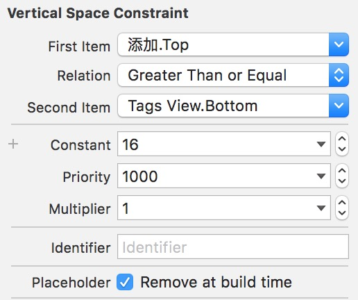
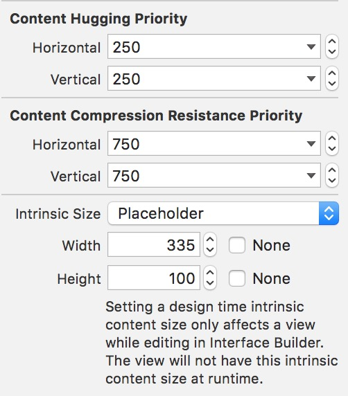
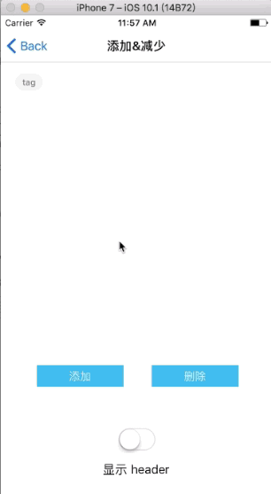

> Why: 之前学习封装了下类似标签页的控件但是并不能根据内容大小来变化高度，看了别人的代码学习下自定义控件如何自适应内容大小。做个笔记。

*相关链接：*

* [Github 上功能较全的项目： TTGTagCollectionView](https://github.com/zekunyan/TTGTagCollectionView)

对于自动布局，最大的魅力在于它能随着内容的大小变化自动根据你的约束适应变化控件的大小，来达到显示的效果。所以自定义控件应该具备自适应大小的能力，才能适应更多的场景。最常见的场景就是 cell 上添加控件的时候。 

# How：
为此看了下  [其他人开源项目： TTGTagCollectionView](https://github.com/zekunyan/TTGTagCollectionView) 学习下代码。看到自适应部分关键的代码在于一下几句话：

```
#pragma mark - Layout

- (void)layoutSubviews {
    [super layoutSubviews];
    _collectionView.frame = self.bounds;
    if (!CGSizeEqualToSize(self.bounds.size, [self intrinsicContentSize])) {
        [self invalidateIntrinsicContentSize];
    }
}

- (CGSize)intrinsicContentSize {
    return _layout.collectionViewContentSize;
}

#pragma mark - Public methods

- (void)reload {
    [_collectionView reloadData];
    [self invalidateIntrinsicContentSize];
}   
 
```

关键的两个方法是：

* `invalidateIntrinsicContentSize `  ：使视图原有的内容大小无效。手动调用这个方法后，会自动调用  `intrinsicContentSize`  方法。

        使视图的内在内容大小无效。
        当您的自定义视图中的某些内容更改使其内在内容大小无效时，请调用此方法。 这允许基于约束的布局系统在其下一个布局遍中考虑新的内在内容大小。


* `intrinsicContentSize` ：重新设置视图的内容大小。

        接收视图的自然大小，仅考虑视图本身的属性。
        自定义视图通常具有他们显示的布局系统不知道的内容。 设置此属性允许自定义视图与布局系统通信其想要基于其内容的大小。 该内在大小必须与内容框架无关，因为例如，没有办法基于改变的高度动态地将改变的宽度传送到布局系统。


从文档上可以看出只要用这两个方法基本就可以完成自是以内容大小的功能。关键在于在什么时机调用这两个方法去更新视图内容的大小了。

</br>
#### **值得一提**
在 storybored 或者 xib 中设置视图约束的时候，如果要设定高度变化的话，记得勾选相应的约束 remove at build time 这个选项来保证高度是可以变化的：



或者在下图这个 Instrinsic Size 的属性里设置为 Placeholder，暂时给予视图一个占位的内容大小， 来避免 Xcode报错：



# what
然后，修改了自己学习封装的类似标签页的控件的代码。让其具有自适应内容的大小：



[Demo 项目地址](https://github.com/linsyorozuya/LHTagsViewDemo)

