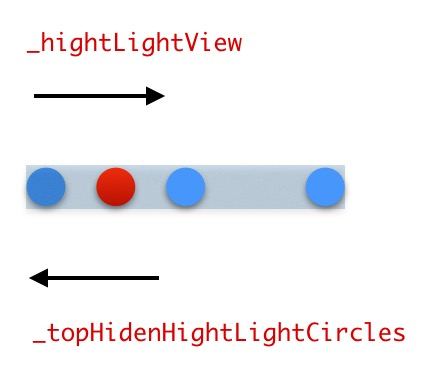

> 在看 [`kittenyang:在iOS中实现Smartisan OS中首页的PageControll效果`](http://kittenyang.com/pagecontrol/) 和 [`视错觉：从一个看似简单的自定义控件说起`](http://www.cnblogs.com/ludashi/p/4994520.html) 这两篇文章感觉可以更好的实现实现 Smartisan OS 中首页的 PageControl 效果。

锤子的效果：


首先 kittenyang 实现的，当亮点划过两个暗点的中间是还是显示的


再看视错觉文章里的效果：


最终实现的效果：


##### 实现原理

首先从效果看锤子的亮点，像是从孔的下方移动。所以给人感觉是上面挖了一排孔，亮点在地道移动所以两个空中间的地方看不到移动的亮点。所以不能直接使用一个 view 移动来解决。

恰巧看到另一篇文章，想到也许可以试试。

**原理就是：使用 mask 隐藏和利用相对移动产生时差。**

实现步骤：

1. 在自定义的 `LHPageControlview` 上创建几个未选中状态颜色的圆 darkCircle。

2. 在自定义的 `LHPageControlview` 上创建一个圆大小的但透明的`_hightLightView`，它的作用就是利用 `mask` 属性将它子视图中超出 `_hightLightView` 显示区域的其他高亮的几个圆藏起来。

3.`_hightLightView` 上添加 `_topHidenHightLightCircles` 视图，然后在 `_topHidenHightLightCircles` 上面添加相应数量的选中状态的圆`lightCircle`，注意他们的位置相对于 `LHPageControlview` 上的 `darkCircle`要一一对应。

整个控件结构如下图：


**移动的时候，移动 `_hightLightView` 的同时 `_topHidenHightLightCircles` 往相反方向移动同样距离，这样在视觉上就好像 `_topHidenHightLightCircles` 是静止的，看上去只是 `_hightLightView` 在移动。**

**这样当 `_hightLightView` 移动到选中状态的圆 `lightCircle` 时，相应的未选中状态的 `darkCircle` 上就像有高亮的圆 `lightCircle` 移动过来遮住并显示。**

移动时如图：



移动的关键代码：

```
CGFloat scale = distance - (int)distance;
if (scale == 0 && distance>=1) {
    scale = 1;
}

CGFloat moveDistance = distance*(kPageHeight+5);

CGAffineTransform transform = CGAffineTransformIdentity;


transform = CGAffineTransformTranslate(transform, moveDistance, 0);


if (scale >= 0 && scale <= 0.2) {
    transform = CGAffineTransformScale(transform, 1.0-scale, 1.0-scale);
}

if (scale > 0.2 && scale < 0.8) {
    transform = CGAffineTransformScale(transform, 0.8, 0.8);
}

if (scale > 0.8 && scale <= 1) {
    transform = CGAffineTransformScale(transform, scale, scale);
}


_hightLightView.layer.affineTransform = transform;


transform = CGAffineTransformIdentity;

transform = CGAffineTransformTranslate(transform, -moveDistance, 0);

_topHidenHightLightCircles.layer.affineTransform = transform;


```

这样就实现了基本效果。

~我在中间为了实现缩小效果，使用实时改变 _hightLightView layer 的 cornerRadius 大小。如果慢慢拖动会发现中间是有些问题的。(希望指教有什么好的方法 =。= 谢过)~

解决  
还是得自己解决。=。=。最近看到 `CGAffineTransform` 这个类，可以直接根据自己的中心点来进行缩放和移动。省去了再去计算在父 view 的坐标去移动。

Github 代码：[`传送门`](https://github.com/LinBling/LHPageControlTry)

