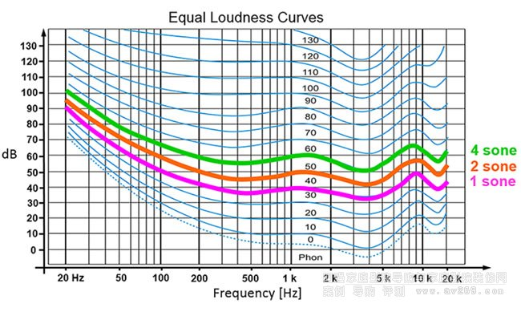
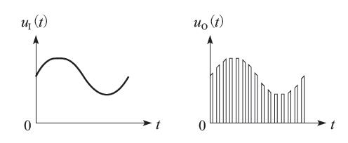
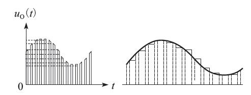

>  《音视频开发进阶指南》笔记。

# 音频

## 声音的物理性质

### 声音是波

声音是由物体震动对周围空气产生挤压，从而产生声音。声音是一种压力波。当演奏乐器、拍打一扇门或者敲击桌面时，它们的振动都会引起空气有节奏的振动，使周围的空气产生疏密变化，形成疏密相间的纵波（可以理解为石头落入水中激起的波纹），由此就产生了声波，这种现象会一直延续到振动消失为止。

### 声波三要素

声波的三要素是频率、振幅和波形，频率代表音阶的高低，振幅代表响度，波形代表音色。

频率（过零率）越高，波长就越短。低频声响的波长则较长，所以其可以更容易地绕过障碍物，因此能量衰减就小，声音就会传得远，反之则会得到完全相反的结论。

响度其实就是能量大小的反映，用不同的力度敲击桌子，声音的大小势必也会不同。在生活中，分贝常用于描述响度的大小。声音超过一定的分贝，人类的耳朵就会受不了。

音色其实也不难理解，在同样的音调（频率）和响度（振幅）下，钢琴和小提琴的声音听起来是完全不相同的，因为它们的音色不同。波的形状决定了其所代表声音的音色，钢琴和小提琴的音色不同就是因为它们的介质所产生的波形不同。

人类耳朵的听力有一个频率范围，大约是20Hz~20kHz，不过，即使是在这个频率范围内，不同的频率，听力的感觉也会不一样，业界非常著名的等响曲线，就是用来描述等响条件下声压级与声波频率关系。

如图人耳听到相同响度的声音，在不同频率的情况下需要的声压是不一样的。人耳对 3~4kHz 的声音比较敏感。

### 回声

之所以会有回声是因为声音在传播过程中遇到障碍物会反弹回来，再次被我们听到。若两种声音传到我们的耳朵里的时差小于80毫秒，我们就无法区分开这两种声音了。

## 数字音频

为了将模拟信号数字化，本节将分3个概念对数字音频进行讲解，分别是采样、量化和编码。首先要对模拟信号进行采样，所谓采样就是在时间轴上对信号进行数字化。根据奈奎斯特定理（也称为采样定理），按比声音最高频率高2倍以上的频率对声音进行采样（也称为AD转换），1.1节中提到过，对于高质量的音频信号，其频率范围（人耳能够听到的频率范围）是20Hz～20kHz，所以采样频率一般为44.1kHz，这样就可以保证采样声音达到20kHz也能被数字化，从而使得经过数字化处理之后，人耳听到的声音质量不会被降低。而所谓的44.1kHz就是代表1秒会采样44100次。

那么，具体的每个采样又该如何表示呢？这就涉及将要讲解的第二个概念：量化。量化是指在幅度轴上对信号进行数字化，比如用16比特的二进制信号来表示声音的一个采样，而16比特（一个short）所表示的范围是[-32768，32767]，共有65536个可能取值，因此最终模拟的音频信号在幅度上也分为了65536层。

既然每一个量化都是一个采样，那么这么多的采样该如何进行存储呢？这就涉及将要讲解的第三个概念：编码。所谓编码，就是按照一定的格式记录采样和量化后的数字数据，比如顺序存储或压缩存储，等等。

通常所说的音频的裸数据格式就是脉冲编码调制（Pulse Code Modulation，PCM）数据。描述一段PCM数据一般需要以下几个概念：量化格式（sampleFormat）、采样率（sampleRate）、声道数（channel）。以CD的音质为例：量化格式（有的地方描述为位深度）为16比特（2字节），采样率为44100，声道数为2，这些信息就描述了CD的音质。而对于声音格式，还有一个概念用来描述它的大小，称为数据比特率，即1秒时间内的比特数目，它用于衡量音频数据单位时间内的容量大小。而对于CD音质的数据，比特率为多少呢？计算如下：

44100 * 16 * 2 = 1378.125kbps

那么在1分钟里，这类CD音质的数据需要占据多大的存储空间呢？计算如下：

1378.125 * 60 / 8 / 1024 = 10.09MB

当然，如果sampleFormat更加精确（比如用4字节来描述一个采样），或者sampleRate更加密集（比如48kHz的采样率），那么所占的存储空间就会更大，同时能够描述的声音细节就会越精确。

### 分贝

前面提到过分贝，那么什么是分贝呢？分贝是用来表示声音强度的单位。日常生活中听到的声音，若以声压值来表示，由于其变化范围非常大，可以达到六个数量级以上，同时由于我们的耳朵对声音信号强弱刺激的反应不是线性的（1.1节中提到过等响曲线），而是呈对数比例关系，所以引入分贝的概念来表达声学量值。所谓分贝是指两个相同的物理量（例如，A1和A0）之比取以10为底的对数并乘以10（或20），即：

N= 10 * lg（A1 / A0）

分贝符号为“dB”，它是无量纲的。式中A0是基准量（或参考量），A1是被量度量。

# 图像

## 图像的数值表示

