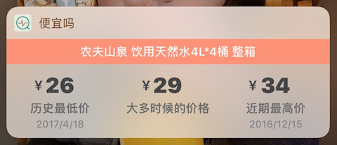
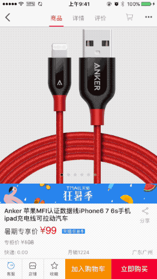

WHY
---

很久很久以前…

淘宝是有价格变化曲线的，利用曲线可以很大程度上防止商家的虚假促销。但是不知到出于什么原因后来取消了这个功能。

庆幸的是浏览器上目前还有几款插件来显示历史价格，不幸的是手机上并没有。

只发现一款叫 `比一比价` 的 app 提供了这个功能（没有开发 widget），而且能查询大部分电商商品的价格曲线。

虽然可以查询，但是这个 app 的搜索过程繁琐，要是想查询一个商品的价格，你需要四个步骤：

*   1. 复制商品的衔接
*   2. 打开 app
*   3. 黏贴 链接
*   4. 点击搜索

可是我喜欢那种 Pin 和 TodayMind 那种无需打开 app 只需下拉通知栏就能使用的的快捷方式 @。@，所以我想要的步骤是：

*   复制商品链接
*   下拉通知栏

所以来了兴趣想自己写个 widget, 也学习下了解下通知栏的开发~

**（开发使用的是 `比一比价` 手机端使用的查询接口。由于数据不全，也就没做显示价格曲线的功能了）**

这个 APP 叫`便宜吗`，顺便也瞎弄了个图标~

看使用效果：



官方文档关于 Today Extention 的篇幅不大。基本的要用的方法都讲到，然后再看看其他人的文章就可以开始入手了。（可以参考文章底部引用的两个链接地址。）

便宜吗的功能实现上很简单，主要就三个步骤：

1.  获取系统剪贴板上的链接：
2.  利用链接请求数据
3.  将数据显示到控件上

当然还有一些细节处理，比如保存上次搜索的历史记录、如果地址相同显示上次搜索的数据等等。

这里主要记录下开发中遇到的一些问题（基于 iOS 10）：

*   **高度问题**：iOS 10 后 widget 高度有两种模式：折叠和展开。  
    折叠模式的最小高度是 110，但也是这种模式下的最大高度。对的，不能更改 @。@。  
    展开模式有最大高度的限制，根据设备的不同最大高度也是不同。

设置扩展模式需要添加以下代码：

```
- (void)viewDidLoad {
    [super viewDidLoad];
    
    self.extensionContext.widgetLargestAvailableDisplayMode = NCWidgetDisplayModeExpanded;
}

#pragma mark - 切换展开和折叠的模式执行的方法
- (void)widgetActiveDisplayModeDidChange:(NCWidgetDisplayMode)activeDisplayMode withMaximumSize:(CGSize)maxSize
{
    if (activeDisplayMode == NCWidgetDisplayModeCompact) {
        self.preferredContentSize = maxSize;
    }else
    {
		  
        self.preferredContentSize = CGSizeMake(maxSize.width, 300);
    }
}
```

*   **背景色问题**：默认的 widget 本景色是一个有些毛玻璃效果的白色。你如果试图改变成其他颜色的话，目前我发现的一个问题是 widget 底部两个圆角，在下拉通知栏的时候都是直角，通知栏下拉完全后，会有个直角变成默认的圆角的突变。目前我的解决办法是添加圆角来处理（测试圆角为 15 ）。=。=

```
- (void)addCornerRadius:(CGSize)radius
{
    
    UIBezierPath *maskPath = [UIBezierPath bezierPathWithRoundedRect:CGRectMake(0, 0, _contentContainerView.bounds.size.width,_contentContainerView.bounds.size.height) byRoundingCorners:UIRectCornerBottomLeft | UIRectCornerBottomRight cornerRadii:radius];
    CAShapeLayer *maskLayer = [[CAShapeLayer alloc] init];
    maskLayer.frame = _contentContainerView.bounds;
    maskLayer.path = maskPath.CGPath;
    _contentContainerView.layer.mask = maskLayer;
}

```

*   **数据问题**：如果你想在 widget 中，添加一个全局变量来保存临时数据是不可行的。每次下拉通知栏后，所有数据都会清空。相当于每次下拉通知栏，所有的 widget 的生命周期又重新开始。收起通知栏所有 widget 生命周期结束。所以如果要保存上次的变量，可以用 NSUserDefaults 的方法来保存。

总结
--

widget 开发还是要看需求是否符合 widget 的使用场景。由于高度的限制，其实更能去思考开发的核心功能是什么。如何充分利用 110 的空间去做一些便捷实用的事情，也许才是开发 widget 开发真正思考的事情吧。

[代码地址 GitHub](https://github.com/linsyorozuya/IsRealCheap)

##### 额~：

`之前询问过 manmanbuy.com 能否使用相关接口，被否定后我建议他们做个相似的插件查询价格。后来真的做了并且已上线叫 历史价格查询。有这方面需求的可以去下载这个软件。`

**相关链接：**

*   [iOS 开发之 widget 实现](http://www.jianshu.com/p/ca3e11d7686c)
    
*   [App Extension Programming Guide: Today](https://developer.apple.com/library/content/documentation/General/Conceptual/ExtensibilityPG/Today.html#//apple_ref/doc/uid/TP40014214-CH11-SW1)

