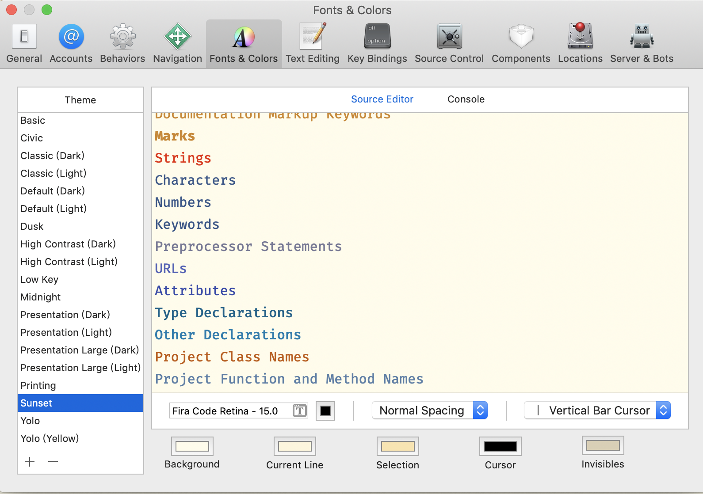
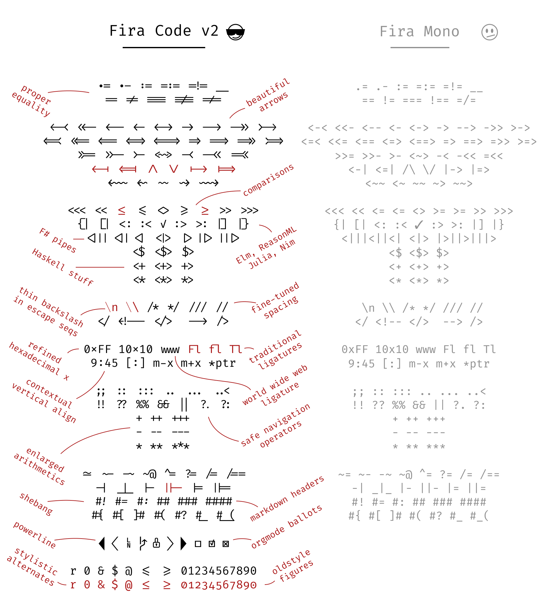
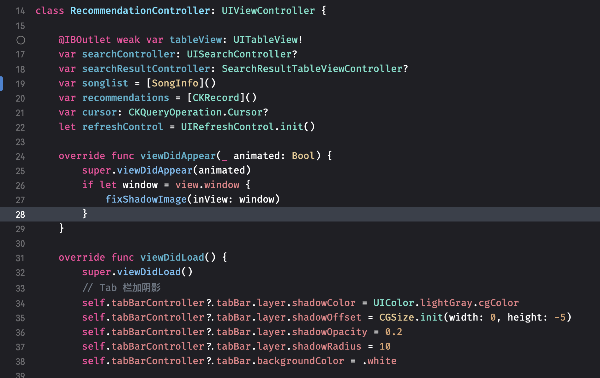

> 最近看了一篇 Xcode 编辑器字体颜色优化的文章 [One-Stop Xcode Coziness](https://medium.com/flawless-app-stories/one-stop-xcode-coziness-ee8dc9c1eb8b)  
> ，感觉效果不错。在此记录记录。

这几年随着不断更新 Xcode 变得更加强大和易用，当然也被越来越多的开发者吐槽它的又胖又慢。但即便大家都在吐槽，但 Xcode 仍然是大部分 iOS 开发者的首选 IDE。

作为一个天天低头不见抬头见的代码编辑器，代码的颜色和字体看起来舒不舒服和简洁明了是非常重要的。 Xcode 的主题就是解决这方面需求的功能。你可以自定义类名、函数名、常量等等类型的代码颜色，这样你可以轻松的区分代码的类型以便更好的调试。

但是 Xcode 自带的主题一部分没有对相应类型的颜色加以区分，比如我喜欢的主题是 Sunset 这种淡黄色的主题就没有很好的区分一些类型的颜色。之前重装 Xcode 后，我都是直接选择 Sunset 主题，然后字体改为 15 号大小。如下图：

### 优化方案

所谓的优化其实就是替换你觉得更好的字体和优化相关的代码类型颜色。当然除了这个还有上文说的我看的文章里提到的通过编程连字体优化 **逻辑运算符**。这个我还是第一次知道，孤陋寡闻了。下图字体为 Fira Code 效果如下：

可以看到想 >= 这种符号就变得很像我们手写的这种符号了。我觉的看起来非常直观，当然每个人感觉不一样。

当然也有有很多编程连字字体，从 [Fira Code](https://github.com/tonsky/FiraCode)， [Hasklig](https://github.com/i-tu/Hasklig) 等免费字体到 [PragmataPro](http://www.fsd.it/fonts/pragmatapro.htm) 等付费字体。你可以在 [ProgrammingFonts 上](https://github.com/ProgrammingFonts/ProgrammingFonts) 浏览这些字体，也可以调整所需的字体，我觉得 Fira Code 挺好看的就使用 Fira Code 了。

然后文章作者实现了一个代码颜色和连字字体的 Xcode 主题，**Yolo-theme。** 你可以在他的 GitHub 上查看 [Yolo-theme](https://github.com/wendyliga/yolo-theme?source=post_page-----ee8dc9c1eb8b----------------------)

### 放置主题文件地址

下载主题后将文件放入 `~/Library/Developer/Xcode/UserData/FontAndColorThemes`, 然后重启 Xcode 在设置里选择主题即可。

