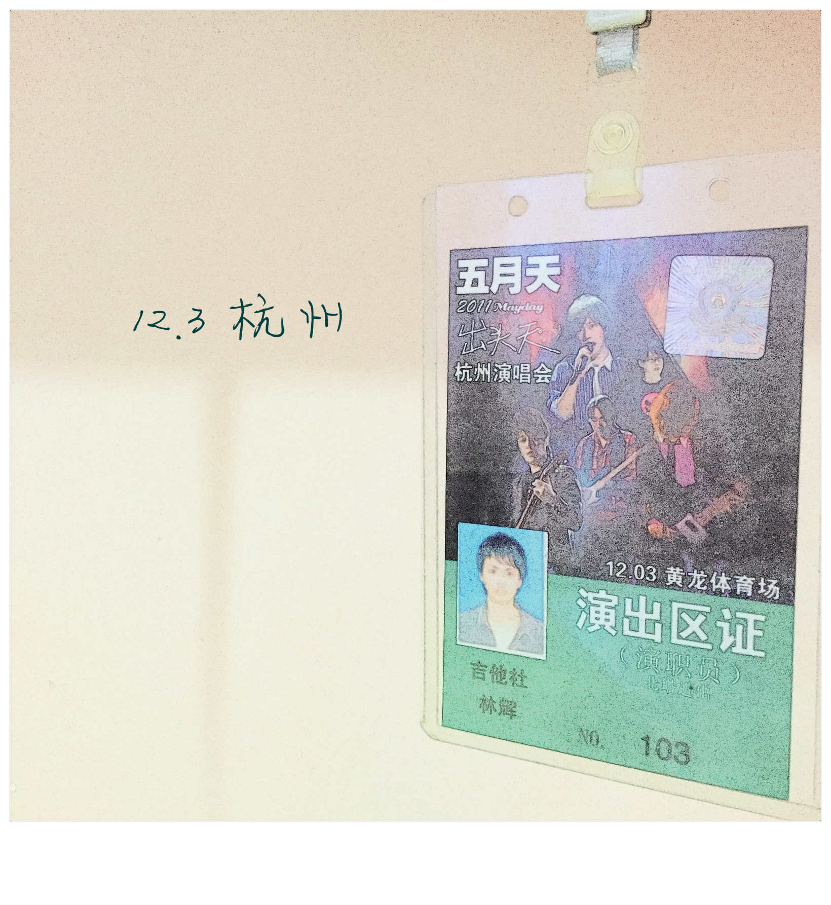
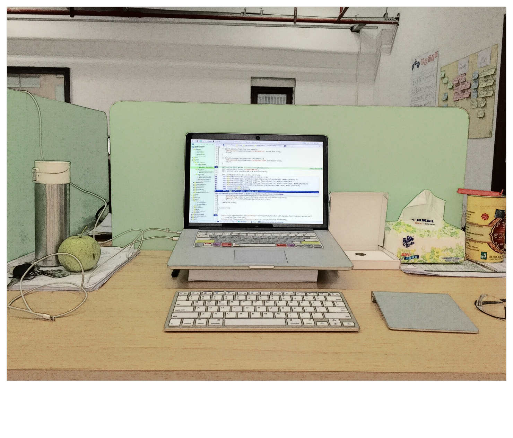
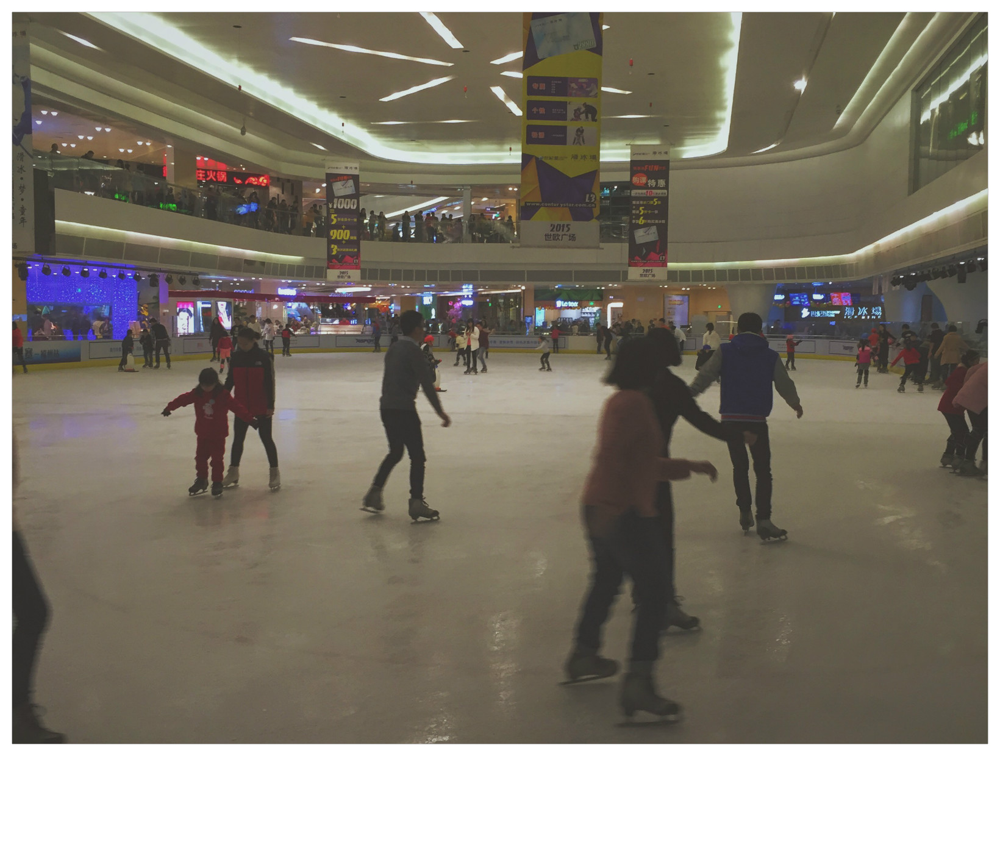

> 致我们心中尚未崩坏的地方

天气冷

听着五月天的闽南语新歌《勇敢》

让我想起了那么冷只穿一件衬衫，抱着吉他蹩脚的拨弄吉他在五月天的的演唱会上  
哼着临时学的蹩脚的闽南《憨人》但是心是热的，对那时候的我来说那是一场梦

像梦一样，庆幸自己是幸运的。一切都那么顺其自然，一直很知足

喜欢的，不被喜欢的

都一样感谢

希望我们能在尚未崩坏的地方，找到自己的出头天

> 关于工作

今天小叶也离职了。这样开心学基本各个职位全离职。虽然还会招，但和我来的时候已经完全不是同一个环境了

这一年，从刚入公司自学到上线了真正意义的独立开发的 iOS App。说实话从 0 开始，没有人指导。代码完全就是做到哪写到哪，完全是没有架构而言。所以代码是混乱的，虽然后来也尽量做了优化、解耦，但是还是几块功能没法整理。也有服务端的混乱导致的无法下手

总之项目，从我进公司一段时间就觉得项目组就是完全混乱无序的，需求没有经过辩证，感觉需求应该是大家讨论分析好坏再决定是否有必要再开始安排执行。而且能明显感觉项目上流程是的缺陷，可能导致后来的许多无用功

功能的好坏而且是否有必要在自己的项目上使用，都必须从自己定位出发。可以很好地借鉴，但不能一味模仿。当然经验的积累是也是从模仿开始，但是不能只是模仿

期间自作主张，改了部分功能的。也有些不必要的功能，就没做进去。后来证明多少是对的

**一个好的产品，需要知道什么该有什么不该有，怎么样好看怎样不好看，如何体验和设计是好的体验和设计，任何人都要学会独立思考，产品更不能缺这点**

在公司的这段时间，自己从一个新员工，变成现在估计是最老的几个员工之一。可以看出公司的变动是不正常的。开心学项目的同事几乎全部离职。从技术开始，接着运营，到项目经理，到产品，最后运营能走的全走了

主要的原因就是由原来的双休和老板的一意孤行。在自己本身薪资待遇低于平均水准的情况下，公司单方面的决定双休改成大小周，先不说违法合同违约和没有任何待遇上的补偿措施。自以为的员工会和公司共存亡，这般的一厢情愿的想法。我不知道老板是从哪里来的自信

结果就是有经验的员工陆续出走，各奔前程罢了

**一个好的公司，需要先尊重员工的利益，员工才会保护公司的利益**

之所以自己没走，一方面由于人员大量变动开心学项目进展基本停滞状态。一方面接的同事坑人的外包还未完结。（钱都没拿到手）但是最大一个原因觉得这是个学习的好机会。

就像谁说的：**在公司，谁会给你时间学习其他项目需求外的东西，真正学习的时间都是下班后的几个小时。这样，我是幸运的。我上班的时候是有时间学习的。所以这是我一直不急的走的原因。自己还是水平不高**

> 关于生活

不知不觉也工作了开一年了，感谢有这样一个离家 10 分钟电驴的距离，中午还能回去吃饭睡觉。打卡也不严。学习开发

这一年看的书不多估计两只手能数过来，不过比起以前也是有很大的进步。以前把时间都花费在发呆，有的没的是事情上了。现在慢慢懂得该做些什么，目标也渐渐清晰起来。不在那么茫无目的。

读过的书目这里记录下勉励自己：

[知行合一王阳明（1472—1529）](http://book.douban.com/subject/25911978/):

值得一读的书，讲了悟道的一声。理解什么是知行合一。想起杭州的有所小学之前路过好像叫阳明小学，门口写着知行合一。那时候可不认识心学大师。=。=

王小波的书籍：

时代三部曲，特立独行的猪，沉默的大多数。幽默、有趣的文笔，也有很多赤裸的描写（你懂得）。什么小和尚，乳，XXOO 之类的（但是这些不是重点）。重点是他的逻辑。想不出他还是程序猿

[乖，摸摸头](http://book.douban.com/subject/25984204/)：

讲了大冰丽江生活的遇到的各类朋友的故事，很贴近生活。看到很多不同与自己的生活。躲起来挺有意思的，也有感动人与人的各种复杂感情

[看见](http://book.douban.com/subject/20427187/):

感觉是一本讲述柴静关于自己处事上的反复考量，对于记者这份职业的思考。怎样才能做得客观。怎样不参杂个人感情做最正确的判断。

很喜欢里面有句话：一个世界如果只是按黑白强弱分，它很可能只是一个立方体，你把它推到，另一面朝上，原样存在

[MacTalk 人生元编程](http://book.douban.com/subject/25826578/):

讲了一些 Mac 使用的技巧，讲了一些人文职场的见解。挺有趣也有用的一本书

[黑客与画家](http://book.douban.com/subject/25724948/)：

关于书呆子那篇映象比较深刻。降到了编程、创业方面的建议。值得一读

[催眠师手记、天才在左疯子在右](http://book.douban.com/subject/4242172/)：

这两本是荔枝 fm 听完的（FM57898 看不见的世界：推荐这主播声音很好听，读起来很有意思）。这两部书同一个人写的，我听的是很入迷。讲了很多让你觉得能在智商上碾压你的疯子，大部分疯子是对某个点研究或执着倒了常人达不到的境界，和所有人都不一样成了不同的那个

[解忧杂货铺](http://book.douban.com/subject/25862578/):

挺有趣的故事设定，超越时空的信件来往。

[别相信任何人](http://book.douban.com/subject/6832303/)：

记忆只能保存一天怎么办，写日记。每天起床经历同样的事，看下之前写的日记告诉自己是谁，为什么这样。。。

[Effective Objective-C 2.0](http://book.douban.com/subject/25829244/):

还在看。感觉很有帮助的一本书。讲了一些之前很多不懂的知识点。

> 2016

学更多东西，涉猎更多方面

做更多提升幸福感的事

