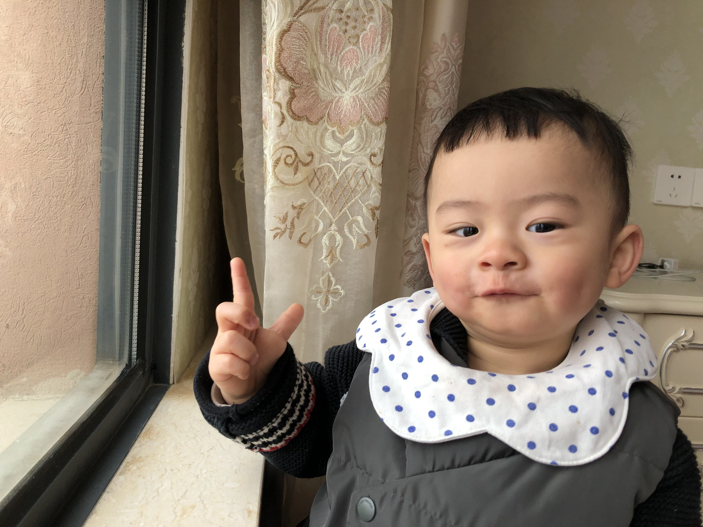
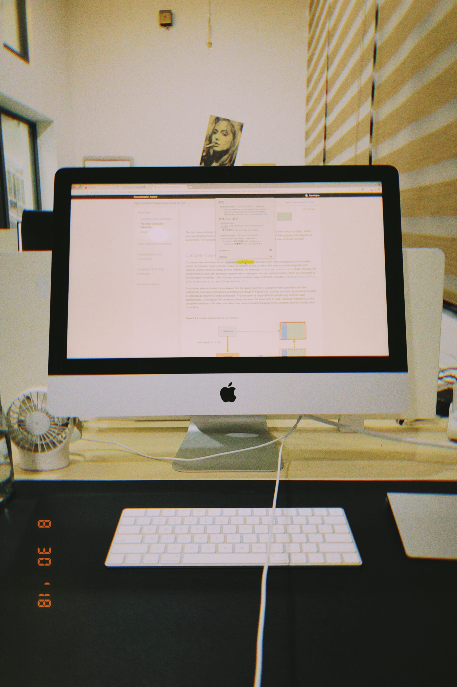
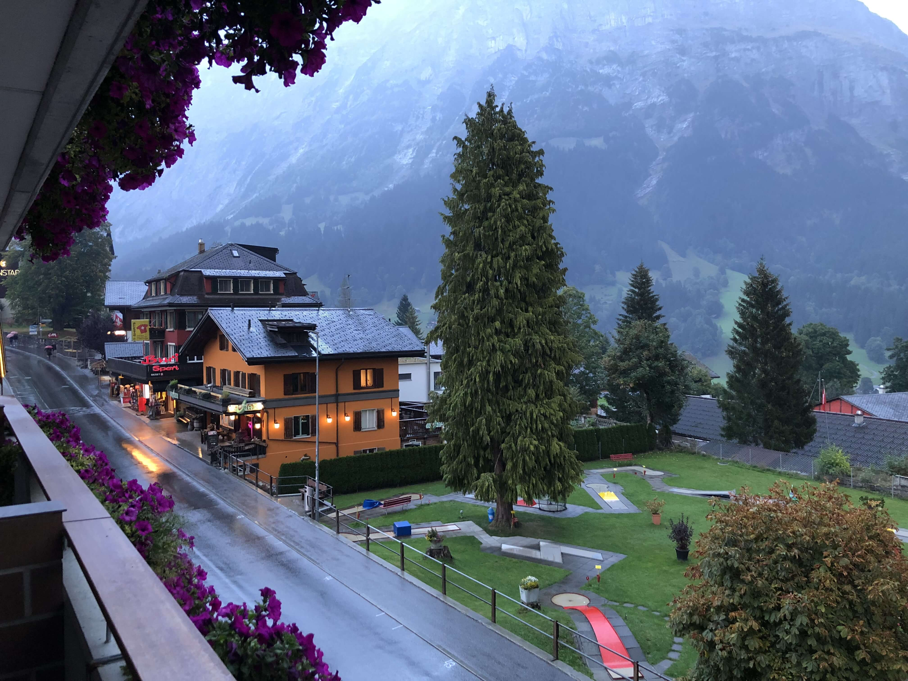
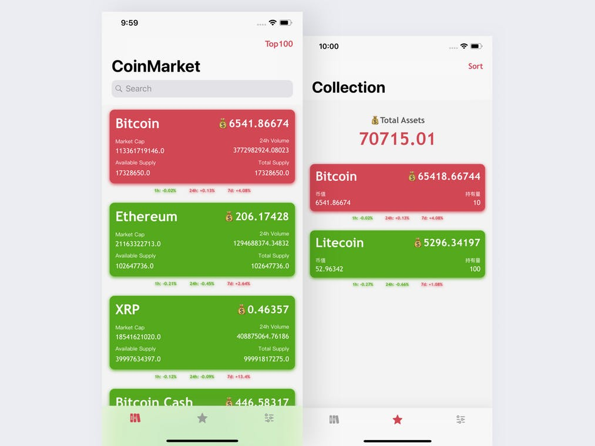

> 今年发生的事情挺多的。大部分都是好的，一切也是往好的方向发展吧。身份的转变和工作环境的变化，身边又换了一波人。

家庭
--

最大的感触就是不知不觉已经作为一个爸爸的身份一年了。  
辉宝长得很快，看着他不会爬到会爬，不会走到会走，不会说话到说话。从不会到会真的是很神奇的事情，某个时间点突然量变到质变。一下就会爬，就会走，就会说话。感叹于生命有一种大道至简的感觉。一切的质变都归结于不断的积累和尝试。

工作
--

到新公司也快一年的。新的工作环境新的同事都让我很快适应。iOS 在工作中也没有更多深入的进阶，一直都是业务驱动工作。不过得益于志哥大神的水平还是学到了一些东西，并佩服于志哥代码上的深度和广度。  
来到公司后，第一次体会到团队开发的样子。  
有好的一面也有不好的一面吧。  
好的一面，可以看别人是怎么写代码的。从中学习好的地方，避免其不好的地方。  
坏的一面，修改别人的代码是痛苦的。别人的代码毕竟是别人的，他写的时候按他的知识面来构建代码。好的代码你可以一眼看出并理解其用意，而不好的代码，错综复杂，难以理解看得水深火热才能摸到其中的逻辑和想法。  
团队开发最重要的架构的选取和权衡，一旦支架子支的不对。后面搬砖都费劲了。

值得一提的是后半年事情少，志哥让我们学了几周小程序和几周的 flutter。  
关于小程序，学习的时候顺便又熟悉了一遍 JavaScript 和 flex 布局。虽然小程序有坑，当时在小项目上，小程序是值得可以尝试的。  
Flutter 学习了几周后，因为要开始新的项目暂时停止了。但是也学习了基本的控件的使用，如果项目不涉及影视频方面的话，用 flutter 开发还是挺快的。

旅行
--

10 月份和德伟去了趟瑞士🇨🇭，也是第一次出国。很多事情都是第一次，很新鲜很有趣。一路上用蹩脚的英语和好几对外国的老夫妇聊天。一个个都很热情有趣，感觉说英语也并没有那么难。  
也感觉自己跟德伟不一样的地方在于，德伟看的是大自然的无限风光，而我喜欢风景但更喜欢的是去了解每个地方的人文吧。  
这次国外旅行给我感触最深的是当地人悠闲而丰富的生活吧。每个景点到处可见高龄的老夫老妻和带娃的年轻夫妇，徒步登山郊游各处游玩。  
相较而下国内在爸妈这个年龄段还依然肩负着照顾儿孙的重担。自己也得益于父母的照顾，在工资微薄的当下不用去担忧房车的压力。这一切我知道都不是理所应当的，相比大多数人来说我很感激我的父母能给我这样的条件。我一直都觉的自己是幸运的，也很知足。希望自己能有一天更好的回馈给自己的家人。

APP
---

终于上线了个人的第一款 app（CoinsAlbum）。虽然没什么人用，但是也算是达成一项目标。设计上遵循了能使用原始控件就不用第三方库的原则，希望写出来的是个简约好看的产品。最后的结果我自己还算满意的吧。希望今年能做出更多人使用的东西吧~

2019
----

学会如何更高效的学习。寻找一个适合自己的增加可持续收入的方向。  
小目标依然是读更多书，学弹琴。

**Be a better myself !!**  
**Life is fantastic !!!**

