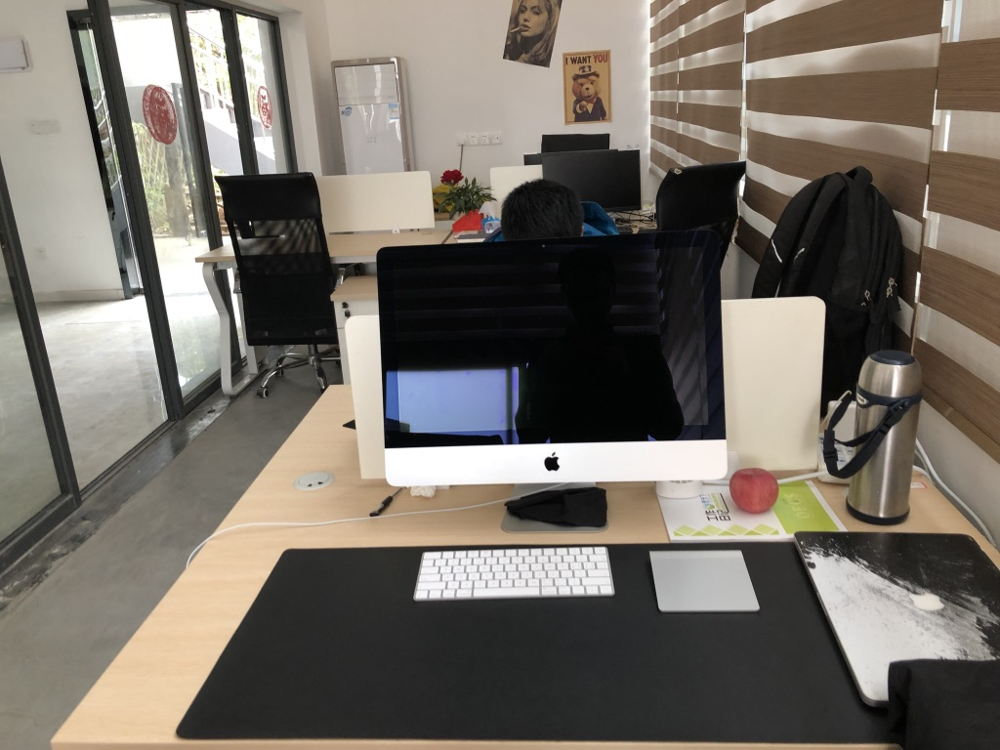
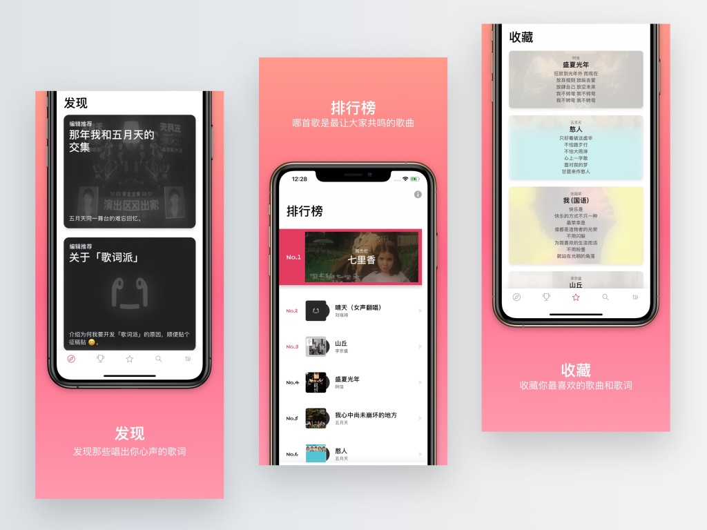
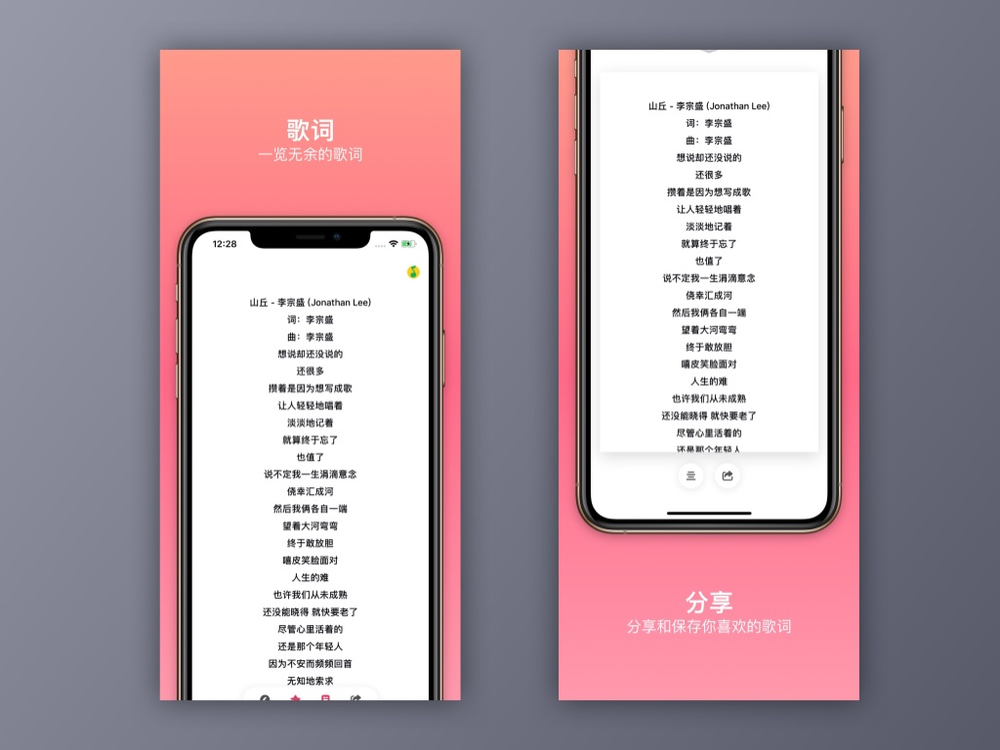
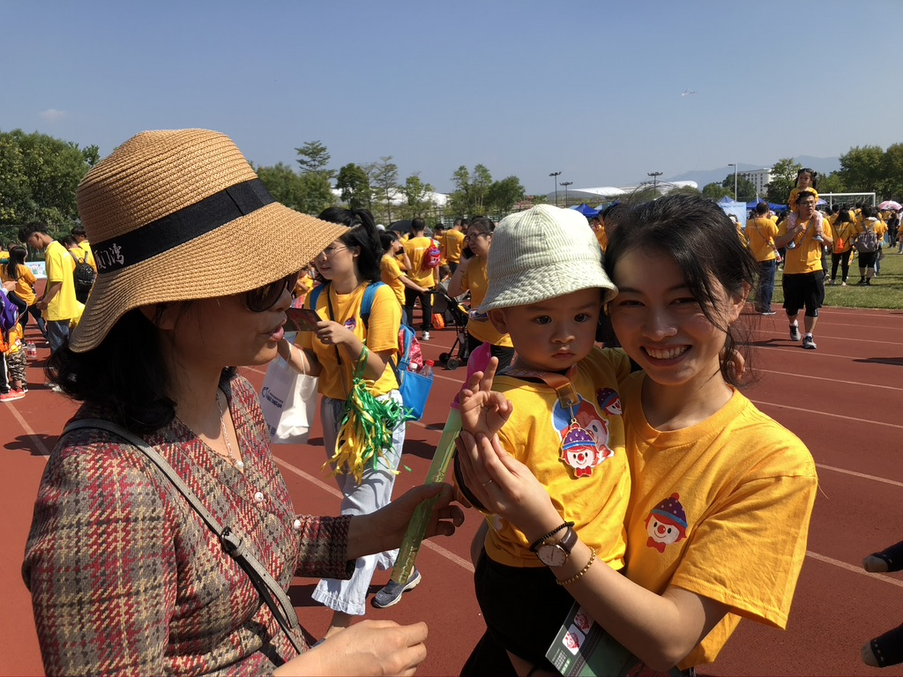
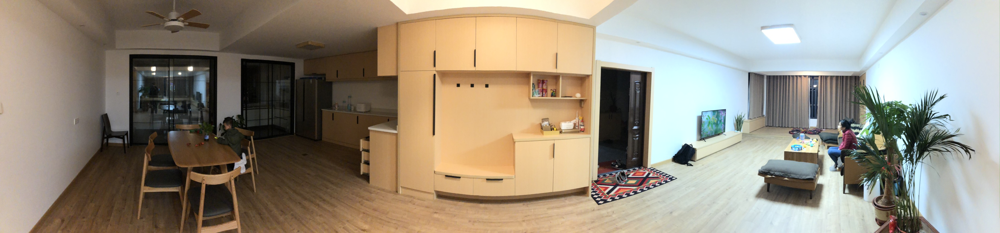
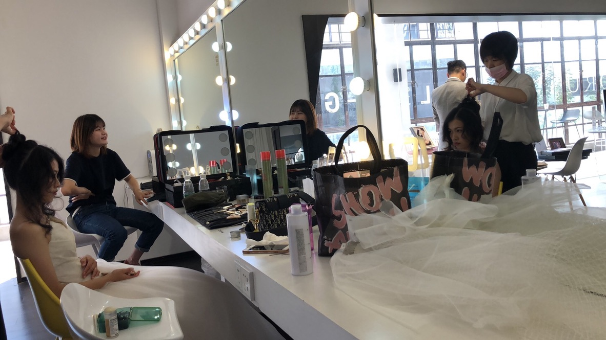
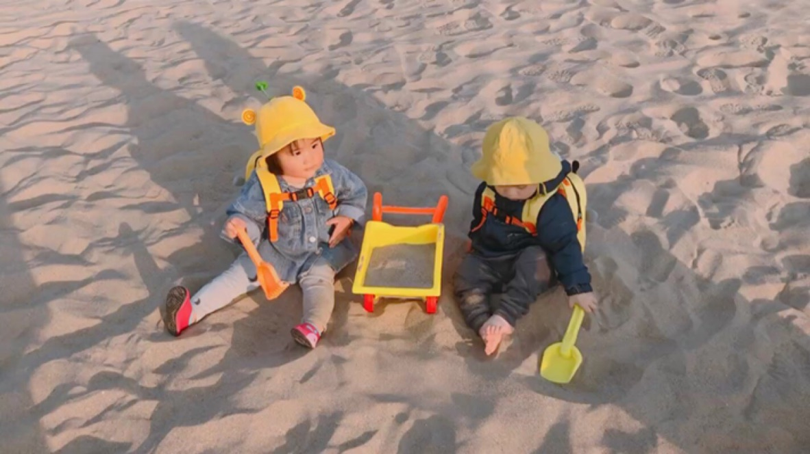
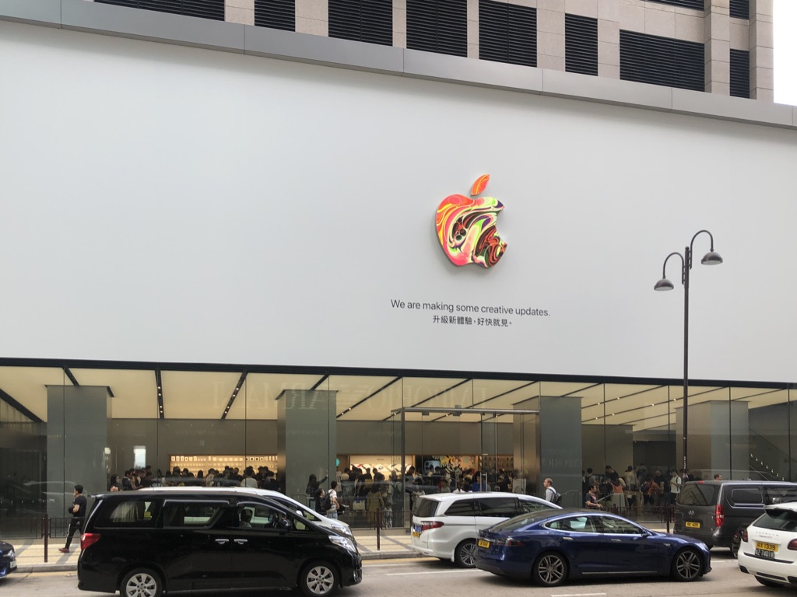

> 又一年过去了，今年是个多事之秋。希望明年步入正轨。

## 工作

上半年公司里空闲期让我们学习了小程序，但是并没有用上。也就自己写了点页面，发现写小程序页面，原来蓝湖里生成的代码完全可以直接用。。。

后来让我跟他一起写 flutter ，也是学到了挺多。虽然没有很深入的学习，只是停留在能用的阶段。但是对 flutter 也是有了一些了解。

随着志高的离职和璐姐的被辞，原来轻松有趣的阳光房破裂了。加上公司一直做些内部的项目让自己也失去对这个公司的留恋。

所以六月辞职了，瞬间成为无业奶爸。当然辞职还有两个原因，一个就是乡下装修爸妈经常不在福州。lulu 一个人有时无法同时照顾辉宝和煮菜家务，也是想在家减轻 lulu 负担多陪陪儿子。二就是想休息一段时间，感觉身体也有点偏离正常的趋势。。。希望调理下身体，陪陪孩子。

## 个人项目
今年根据自己的需求开发了一个可以搜索、收藏很分享歌词的小应用。开发基本结束的时候，才发现歌词类应用也是需要版权才能上架的。结果只能放弃上架，马马虎虎给自己学吉他时候记歌词用了。对于这个 app 的效果和设计，自己还是很喜欢的。

## 家庭

辉宝越来越大了，从不会说话到咿呀学语。再到模仿说话，再到与你对话。

一切都变得有趣，但是也越来越不受控制。当然教育孩子本来就不应该控制，是需要同理。在这点上做父母真的很难，但这也是必须需要学习的。辉宝今年生的最大的病就是最近刚好的鼻窦炎，流鼻有一个多月。上网查病真是什么都能查出大毛病，越看越焦虑。父母心真的都是替小孩操碎的。后面抗生素吃了一周也没见好转，还起了疹子。索性把药停了，结果慢慢好了。所以也不知道是不是抗生素吃好的。

随着下半年待业在家，越来越觉得生活上的开销太大。财务上的问题很严重。虽然待业前也发现每月开销基本与收入持平，但是那时候还是意思到这个问题的严重性。俗话说谈钱伤感情，却是如此。越在乎什么你的精力和关注的点越聚焦在上面，也就出现管窥的现象。

凡是都是有两面性，一边当我的更多的注意力在钱上时，就开始在钱的节流上想做更多努力，尽量避免生活中的一些不必要开支。导致的结果就是 lulu 觉得我变抠门了。生活中为钱而产生的小争吵也开始增多。一边是慢慢的我开始觉得要学习理财投资相关的知识的重要性，开始看更多的书来了解并实践理财投资。

年底统计的全年的消费和收入，结果也是吓人。买了一些股票和基金，目前收益不多，但也是个好的开始。

新年最大的愿望就是全家身体健康和家庭和睦。然后财务上开源节流。

## 装修

从毛呸到现在的样子，基本是按我和 lulu 的想法装出的样子。目前看还是挺满意的。这次装修没有包给别人做，都是爸妈自己找各种工种来做的。虽然价钱上好像也没比全包少。但是东西和风格毕竟也都是自己选的。

## 筹备婚礼

定了明年 2 月 9 号婚礼。基本婚礼的事情都是 lulu 一个人去弄得。因为我对婚礼实在没有什么要求，对于在那么多人面前做一件事对于我来说真的是一件尴尬和不情愿的事情。更多的只是一种长辈们流传的形式大于婚礼本身的意义。

## 旅游

上半年去了桃花岛和杭州一趟。在宁波冰封丈母娘家住了一晚，桃花岛住了一晚，杭州住了一晚。

这也是第一次带辉宝出远门，得出的结论孩子太小真的不适合带出门。累的一比。出发前想象的是辉宝在动车上酣睡，我们玩玩手机就到了。结果却是辉宝根本就没睡过，把 lulu 都带哭了。

冰封丈母娘好热情，煮了一大桌的菜。都有点不好意思。。。

桃花岛呢其实我们就去了一会海边就回去了。对于开几个小时的车来说，这个确实有点得失比有点大，但是主要是大家一起去玩还是挺开心的。

回杭州后和大家几个聚了个餐，也是好久没见了。了解了大家的近况。大家好像也都没怎么变，只是都各自为生活奔波的有点大人的磨样了。

最后一天我们一家去西湖逛了逛，做了观光车绕湖一圈。就匆匆去火车站回家了。

下半年去了香港一趟，给辉宝买保险。也是从我们回来那天香港开始了大骚乱。

希望明年也能抽出时间，一家人出门玩几天。毕竟辉宝大了，应该没那么累了。

## 阅读
一共读了 16 本书。有 5 本是在前 11 个月读的，剩下 11 本 12 月读的全是理财的书。才发现原来自己也可以一下读这么多书。

* P.E.T.父母效能训练
* 冲榜
* 稀缺
* 自控力
* 如何变的有思想
* 价值投资实战手册
* 富爸爸穷爸爸
* 小狗钱钱
* 小狗钱钱2
* 好好赚钱
* 给新手的极简股票课
* 基金投资入门与实战技巧
* 傻瓜式投资
* 财务自由之路③
* 财务自由之路②
* 财务自由之路①

## 总结
今年算是多事的一年，发现了一些人性的丑陋。也开始发现自己的不足。

最大的收获是懂得了财商的重要性。虽然有点晚了，但是亡羊补牢为时不晚。

